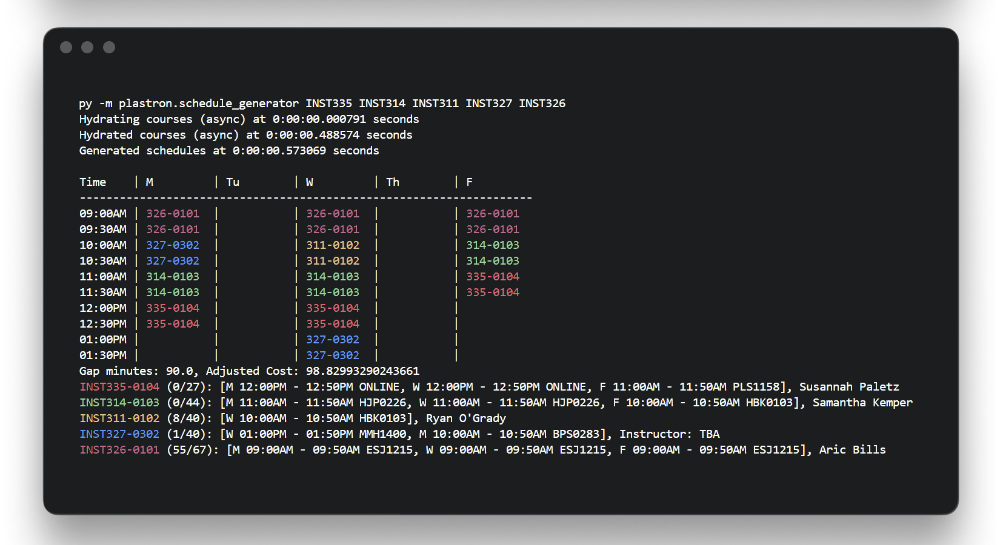

## Plastron

> **plas·tron**  
/ˈplastrən/  
the nearly flat part of a turtle's shell

### Generate schedules from the command line



Install dependencies via [developer instructions](#development).

```bash
py -m plastron.schedule_generator INST335 INST314 INST311 INST327 -n 3
```

Arguments:
- `Course IDs`: List of course IDs (e.g. INST335 INST314 INST311 INST327)
- `-n` or `-num`: Number of schedules to generate (default: 1)
- `-nsg` or `-no-shady-grove`: Do not include ESG sections (default: True)
- `-nfc` or `-no-freshman-connection`: Do not include FC sections (default: True)
- `-o` or `-open-seats`: Include only sections with open seats (default: True)
- `-s` or `-earliest-start`: The earliest start time (default: 8:00am)
- `-e` or `-latest-end`: The latest end time (default: 5:00pm)

### Generate schedules via API

Deployed at: https://plastron.onrender.com/

See and test the API at: https://plastron.onrender.com/docs

## Development

### Get Poetry as a package manager

Poetry manages packages (external snippets of code that other people have already written) locally for our project, so you don't have to install them globally. An example of a package we've used in class is `re` for regular expressions, which is pre-installed and built into python. Another example is `pytest`, which you probably installed globally (this makes sense since you'll be using it everywhere).

```bash
pip install poetry
```

### Install packages

This project comes with a pyproject.toml which is like a list of all the packages it needs.

By using the below command Poetry reads our pyproject.toml and will install everything in the list. The reason why we use packages/package managers is because there's no real point in storing all this extra code in GitHub if we can just define a list and have people install them locally on their computers.

This way the stuff we push and store on GitHub is *our* code only, we only reference the needed external packages. If you go into software engineering you will deal with package managers in basically every language, so this is generally applicable everywhere. E.g. in Java you'd be using Maven or Gradle, in JavaScript you'd be using npm, pnpm, etc, and in Rust you'd use Cargo.

```bash
poetry install
```

### Choose the venv interpreter

- Use CTRL/CMD + SHIFT + P
- Search for and choose `Python: Select Interpreter`
- Enter interpreter path -> Find
- Find and choose `.venv/Scripts/python.exe`

### To run the development server

```bash
uvicorn plastron.api:app --reload
```

You can access the local server at [http://localhost:8000/](http://localhost:8000/)

While docs are available at [http://localhost:8000/docs](http://localhost:8000/docs)
