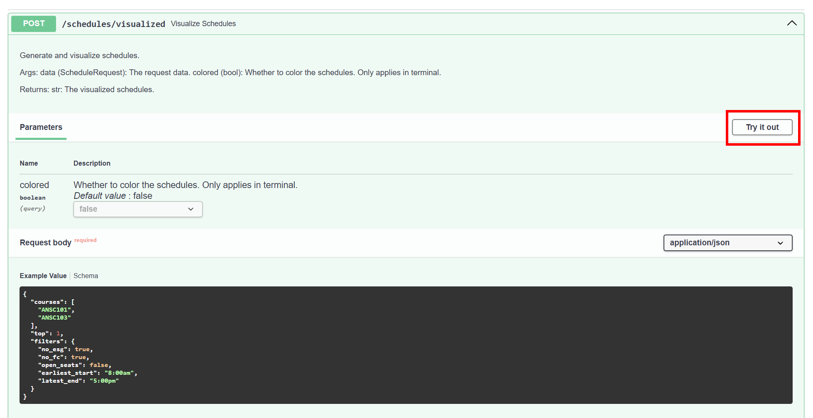
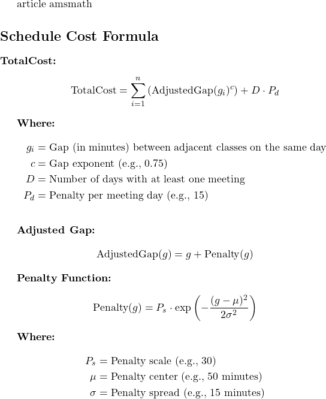

## Plastron

> **plas·tron**  
/ˈplastrən/  
the nearly flat part of a turtle's shell

### Generate schedules from the command line


Install dependencies via [developer instructions](#development).

```bash
py -m plastron.schedule_generator INST335 INST314 INST311 INST327 -n 3
```

Arguments:
- `Course IDs`: List of course IDs (e.g. INST335 INST314 INST311 INST327)
- `-n` or `--num`: Number of schedules to generate (default: 1)
- `-nsg` or `--no-shady-grove`: Do not include ESG sections (default: True)
- `-nfc` or `--no-freshman-connection`: Do not include FC sections (default: True)
- `-o` or `--open-seats`: Include only sections with open seats (default: True)
- `-s` or `--earliest-start`: The earliest start time (default: 8:00am)
- `-e` or `--latest-end`: The latest end time (default: 5:00pm)

### Generate schedules via API

Deployed at: https://plastron.onrender.com/

## Development

### Get Poetry as a package manager

```bash
pip install poetry
```

### Install packages

```bash
poetry install
```

### Choose the venv interpreter

- Use CTRL/CMD + SHIFT + P
- Search for and choose `Python: Select Interpreter`
- Enter interpreter path -> Find
- Find and choose `.venv/Scripts/python.exe`

### To run the development server

```bash
uvicorn plastron.api:app --reload
```

You can access the local server at [http://localhost:8000/](http://localhost:8000/)

While docs are available at [http://localhost:8000/docs](http://localhost:8000/docs)

## Testing

### Unit Testing

```bash
poetry run pytest
```

### E2E Testing

Navigate to https://plastron.onrender.com/docs and run the example request bodies against each endpoint. If the service is active and in a good state, each response should return a 200 status code, along with output matching the documentation given for each endpoint.



Confirm that schedules are generated properly by running the command line example or hitting the `/schedules/visualized` endpoint and comparing the outputted weight against the expected weight per the formula below.


